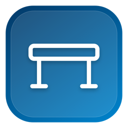
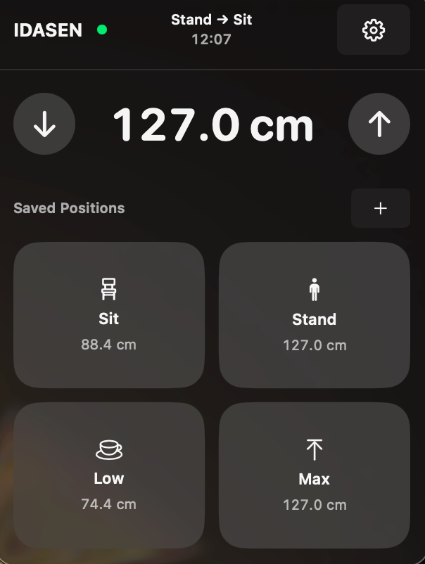
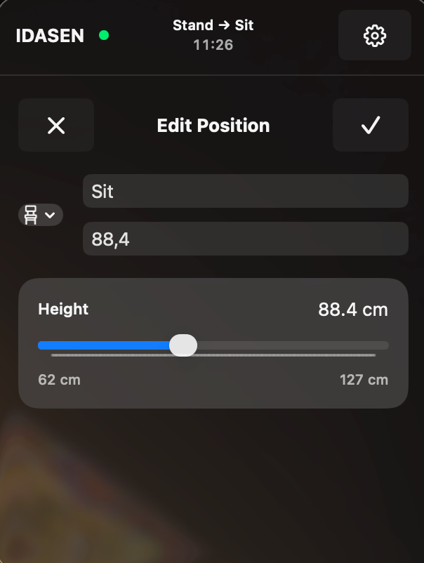
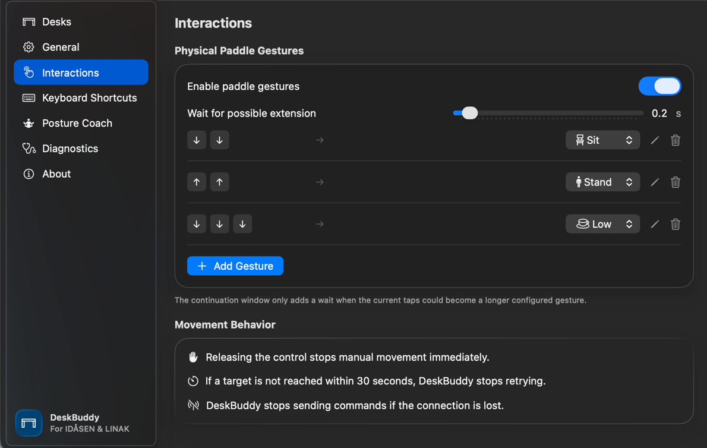
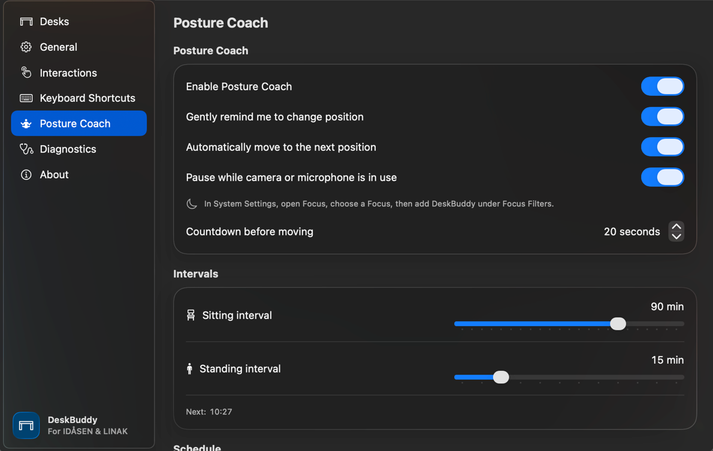

	

<h1 align="center">DeskBuddy</h1>

	<strong>Native menu bar control for IKEA IDÅSEN and compatible LINAK desks.</strong>

	Move to saved heights, build physical paddle gestures, and keep a healthier sit-stand rhythm.

	<a href="https://github.com/koenigderorangen/DeskBuddy/releases/latest"><strong>Download the latest release</strong></a>

	
	&nbsp;&nbsp;
	

	
	

## Your Desk, One Click Away

DeskBuddy keeps everyday desk controls close without turning them into another dashboard.

- **Move your way** — Hold the menu controls, choose a saved position, use a global shortcut, or run an Apple Shortcut.
- **Make the paddle smarter** — Start with double up and double down, then assign custom multi-tap sequences to any saved position.
- **Build a better rhythm** — Set sitting and standing intervals, active hours, reminders, and optional automatic movement.
- **Review your routine** — Compare sitting, standing, and other connected time across days, weeks, months, years, desks, or all time.
- **Stay interruption-aware** — Pause automatic movement while a camera, microphone, or selected macOS Focus is active.
- **See the essentials** — Keep the current height and next posture change visible from the menu bar.
- **Feel native** — SwiftUI, Liquid Glass, launch at login, automatic reconnection, and built-in updates.
- **Free and open source** — No ads, subscriptions, paid tiers, or monetization—ever.

Movement remains under your control: release to stop manual movement, tap the physical paddle to cancel a preset move, or use DeskBuddy's **Stop** button at any time.

## Install

1. Download the latest DMG from [GitHub Releases](https://github.com/koenigderorangen/DeskBuddy/releases/latest).
2. Drag DeskBuddy to **Applications**.
3. Try to open DeskBuddy once. Because DeskBuddy is currently distributed without Apple notarization, macOS blocks this first launch.
4. Close the warning, then open **System Settings → Privacy & Security**.
5. Scroll to **Security**, click **Open Anyway** for DeskBuddy, and confirm **Open**. This is required only for the first launch.
6. Follow onboarding to grant Bluetooth access and connect your desk.

DeskBuddy can check for and install signed updates from **Settings → About**.

## Compatibility

- macOS 26 or later
- IKEA IDÅSEN desks
- Compatible LINAK Bluetooth desk controllers using the same GATT protocol
- Bluetooth access

## Privacy

Meeting-aware pause only queries whether a camera or audio input device is running. DeskBuddy never captures camera frames or microphone audio, cannot identify the app using a device, and does not request camera or microphone capture access.

## Connect Your Desk

1. Quit other desk-control apps and disconnect the desk from them.
2. Hold the Bluetooth button under the desk for at least three seconds.
3. In DeskBuddy, choose **Find Desks**. You can return to the same controls later in **Settings → Desks**.
4. Select your desk and verify the displayed height before moving it.
5. Test a short manual move before using saved positions.

If the desk moves unexpectedly, use DeskBuddy's red **Stop** button or the physical desk control immediately.

## Contributing

Build instructions, debug tools, verification steps, and commit conventions are documented in [CONTRIBUTING.md](CONTRIBUTING.md).

## Protocol and Independence

DeskBuddy uses the publicly documented LINAK/IDÅSEN Bluetooth GATT protocol. It does not include components, artwork, or source code from any commercial desk-control app, and it is not affiliated with IKEA or LINAK.
